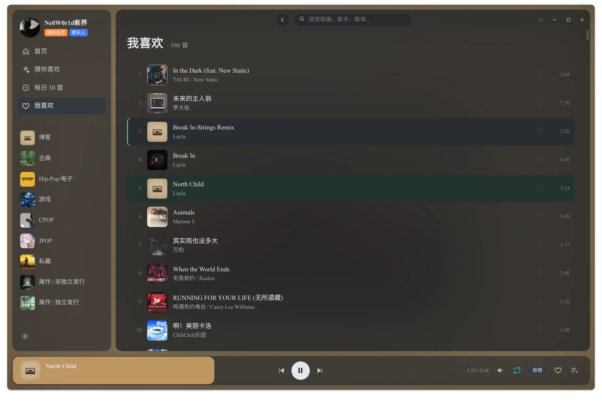
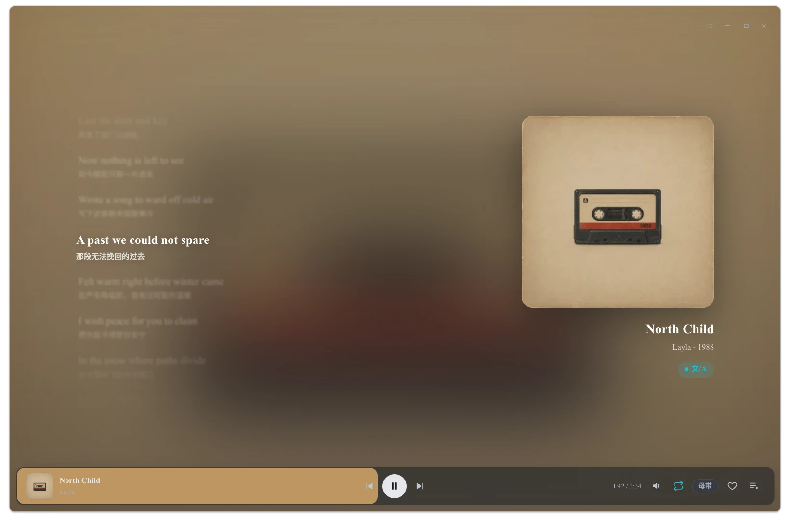

  

# Quaver Music- 又一个第三方 QQ 音乐客户端

Quaver Music，是一款 QQ 音乐的第三方客户端，其目的是为了让 Linux DE / Wayland WM 用户能够爽用，基于 Electron + Vite 实现

名字取自于八分音符，对应了音乐，“QQ” 的 Q 字母。

  

  

> [!CAUTION]
> 真爱音乐，尊重正版，音乐平台不易，该应用**不提供盗版 QQ 音乐服务！**

# 契机

我一直是 QQ 音乐的用户，也用过 NCM 的第三方客户端，Spotify，Apple Music。

然而 QQ 音乐一直没有什么好用的第三方客户端，而同 TME 系的有 [MoeKoe](https://music.moekoe.cn/) ，而转机是在 [Lyrune](https://github.com/amtoaer/lyrune)，一个挺好用的 Rust Q 音第三方客户端，但可惜 Rust 太重了，而且我 Rust 是真的菜。（是的，原作者实现的 CSD 确实比我自己想的上面扩展 CSD 好很多）

所以使用 Electron，对接入 NodeJS 的 API 而言也很方便，开发也很快，也可以避免我孱弱的 Rust 开发，与此同时，后端我也能玩 C++ 这一个我更熟悉的编程语言。故此项目诞生，现正在 Prototype 阶段，逐步新增功能。

# 目标

跟之前的项目 Cipher Tools 一样，这个项目依旧会给每个版本加个代号，目前还是 Prototype，代号为 "Neon"，取自无畏契约角色霓虹，版本号为语义化版本号结构 v+ “x.y.z" 开发代号均出自《无畏契约》的特工 + 《绝区零》的角色，而副分支开发代号取自《鸣潮》和《崩坏：星穹铁道》角色，且副分支开发代号，在未进入正式版开发/收尾阶段，永远都是 Prototype。

x：每一个大版本均为 10 个小版本（典型情况），如遇到更改技术栈/本体出现大改情况除外
y：功能更新版本
z：修补版本号

| 版本号    | 主分支开发代号 | 副分支开发代号        | 隶属开发阶段           |
| ------ | ------- | -------------- | ---------------- |
| v0.x.x | Neon    | Prototype      | Prototype        |
| v1.0.0 | Ellen   | Chisa          | Stable           |
| v1.0.x | Ellen   | Chisa - PatchX | Stable - PatchX* |
| v1.1.0 | Ellen   | Cyrene         | Stable - FEP1*   |

> PatchX：修复包版本 
> 
> FEP：功能启用包

罗马不是一天建成的，为了防止墙被砌歪，在 Prototype 阶段，将完成以下工作

- [x] 基础 UI 建设（播放页主页）
- [x] 使用 WebAPI，完成基础的后端数据获取（换成 Python API 了）
- [ ] 打包 CI
- [ ] 清理 Bugs

现在的基础 UI 设计使用了 Pixso，感谢万兴开发的 Pixso，我大学时期就在用的 UI/UX 设计工具（虽然当时是上课）！

在这三个完成后，将进入 Stable 阶段的开发，在此阶段，我需要完成以下工作

- [ ] MPRIS 支持
- [ ] XDG Desktop Portal Inhibit 协议与 Logind 直连睡眠抑制器实现
- [ ] 使用 PythonAPI 完善后端功能
- [ ] 清理 Bugs

并在未来的 FEP 版本中，加入呼声较高的功能，或未完成实现的功能。

# 协议

该项目使用 AGPLv3 及其未来版本协议协议，其使用的 API 使用 GPLv3 及其未来版本协议和 MIT 协议

[Python - GPLv3-or-later - l-1124/QQMusicApi](https://github.com/l-1124/QQMusicApi)（当前后端，`vendor/QQMusicApi` submodule + `api-server/` 适配层） 
[NodeJS - MIT - yakult-green-tea](https://github.com/yakult-green-tea/qq-music-api)（早期 spike 用过，已替换，见 docs/spike-2）

与此同时，该项目依旧无法避免属于 QQ 音乐第三方客户端，请尊重 QQ 音乐的最终用户协议，禁止破解 QQ 音乐的曲库，本应用仅提供流媒体服务，不提供任何下载服务。
